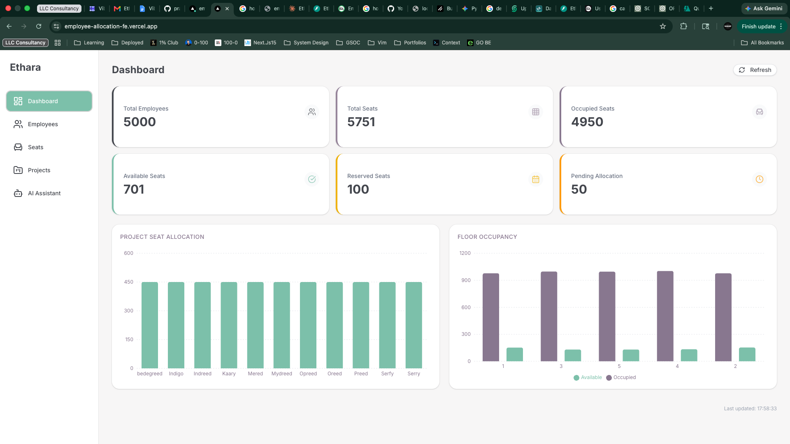
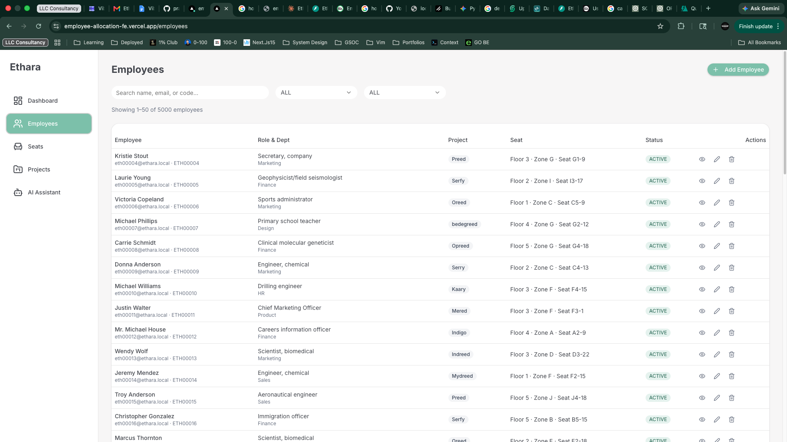
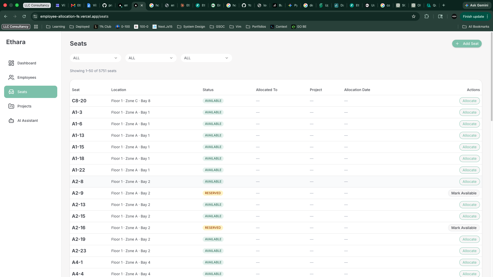
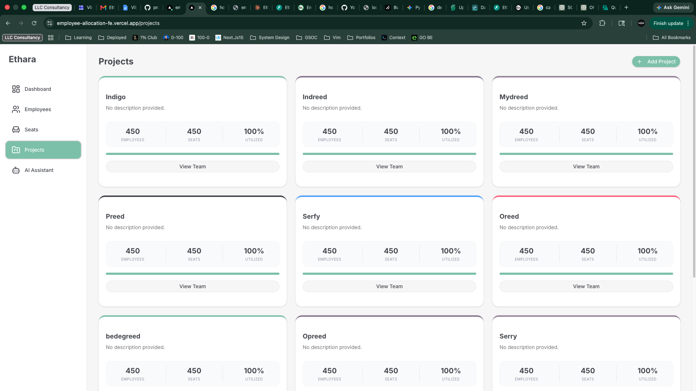
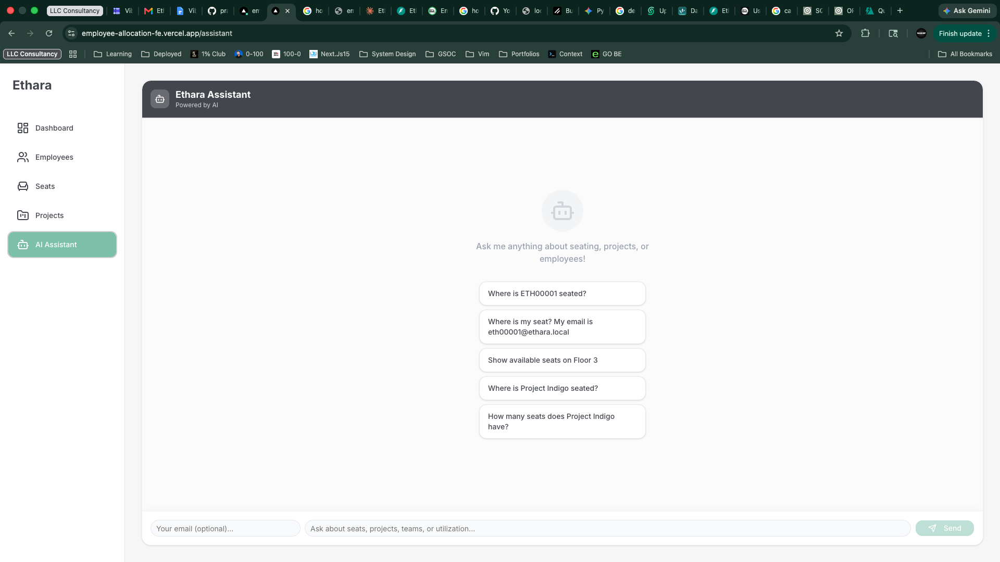

# Ethara Seat Allocation & Project Mapping System

A full-stack application that manages seat allocation for 5,000+ employees across multiple projects, floors, and zones — with an AI-powered natural language assistant for querying seating and project information.

---

## 🔗 Live Links

| Resource                        | URL                                                           |
| ------------------------------- | ------------------------------------------------------------- |
| **Frontend**                    | https://employee-allocation-fe.vercel.app/                    |
| **Backend API**                 | https://employee-allocation-be-production.up.railway.app/     |
| **API Documentation (Swagger)** | https://employee-allocation-be-production.up.railway.app/docs |
| **GitHub Repository**           | `YOUR_GITHUB_REPO_URL_HERE`                                   |

---

## 🏗️ System Architecture

```
┌─────────────────────────────────────────────────────────────────┐
│                        CLIENT BROWSER                           │
│                   Next.js 16 (Vercel CDN)                       │
└────────────────────────────┬────────────────────────────────────┘
                             │ HTTPS / REST
                             ▼
┌─────────────────────────────────────────────────────────────────┐
│                     FastAPI Backend                             │
│                  (Railway — Python 3.13)                        │
│                                                                 │
│  ┌──────────────┐  ┌──────────────┐  ┌──────────────────────┐  │
│  │  /employees  │  │  /projects   │  │       /seats         │  │
│  │   Router     │  │   Router     │  │       Router         │  │
│  └──────────────┘  └──────────────┘  └──────────────────────┘  │
│  ┌──────────────┐  ┌──────────────┐  ┌──────────────────────┐  │
│  │  /dashboard  │  │   /ai/query  │  │  Allocation Engine   │  │
│  │   Router     │  │   Router     │  │  (proximity logic)   │  │
│  └──────────────┘  └──────────────┘  └──────────────────────┘  │
│                                                                 │
│              SQLAlchemy ORM + Alembic Migrations                │
└────────────────────────────┬────────────────────────────────────┘
                             │ TCP (private network)
                             ▼
┌─────────────────────────────────────────────────────────────────┐
│                PostgreSQL 16 (Railway)                          │
│   employees │ projects │ seats │ seat_allocations              │
└─────────────────────────────────────────────────────────────────┘
```

### Key Design Decisions

- **Split deployment** — Frontend on Vercel (edge CDN, instant deploys), Backend on Railway (persistent server, same network as Postgres)
- **Pagination on all list endpoints** — returns `{ data, total, page, limit, total_pages }` to handle 5,000+ records without loading everything into memory
- **N+1 query prevention** — `joinedload()` + batch `IN` queries instead of per-row DB calls. Reduced employee list from 29s → <1s
- **Row-level locking** — `SELECT ... FOR UPDATE` on seat during allocation prevents race conditions when two requests allocate the same seat simultaneously
- **Rule-based AI** — Intent parser with keyword scoring + entity extraction. No external API dependency, zero cost, deterministic responses

---

## 🛠️ Tech Stack

### Frontend

| Technology              | Purpose                 |
| ----------------------- | ----------------------- |
| Next.js 16 (App Router) | Framework, routing, SSR |
| TypeScript              | Type safety             |
| Tailwind CSS            | Styling                 |
| shadcn/ui               | Component library       |
| React Hook Form         | Form state management   |
| Zod                     | Schema validation       |
| Recharts                | Dashboard charts        |
| react-hot-toast         | Notifications           |
| lucide-react            | Icons                   |

### Backend

| Technology     | Purpose                          |
| -------------- | -------------------------------- |
| Python 3.13    | Runtime                          |
| FastAPI        | Web framework, auto Swagger docs |
| SQLAlchemy 2.0 | ORM, query building              |
| Alembic        | Database migrations              |
| Pydantic v2    | Request/response validation      |
| psycopg2       | PostgreSQL driver                |
| Faker          | Seed data generation             |
| Uvicorn        | ASGI server                      |

### Infrastructure

| Technology    | Purpose                    |
| ------------- | -------------------------- |
| PostgreSQL 16 | Primary database           |
| Railway       | Backend + Database hosting |
| Vercel        | Frontend hosting           |
| GitHub        | Version control            |

---

## 📁 Project Structure

```
ethara-seat-allocation/
├── backend/
│   ├── routers/
│   │   ├── employees.py      # CRUD + pagination + N+1 fix
│   │   ├── projects.py       # Project management
│   │   ├── seats.py          # Seat CRUD + allocate + release
│   │   ├── dashboard.py      # Aggregate queries
│   │   └── ai.py             # AI query endpoint
│   ├── services/
│   │   ├── allocation_engine.py  # Proximity-based seat suggestion
│   │   └── intent_parser.py      # Rule-based NL query handler
│   ├── alembic/              # Database migrations
│   ├── main.py               # FastAPI app + CORS
│   ├── database.py           # SQLAlchemy engine + session
│   ├── models.py             # ORM models + enums
│   ├── schemas.py            # Pydantic schemas
│   ├── seed.py               # 5,000 employee seed script
│   ├── clear_db.py           # Database reset utility
│   └── requirements.txt
├── frontend/
│   ├── app/
│   │   ├── page.tsx          # Dashboard
│   │   ├── employees/        # Employee management
│   │   ├── seats/            # Seat management
│   │   ├── projects/         # Project management
│   │   └── assistant/        # AI chat interface
│   ├── components/
│   │   ├── forms/            # RHF + Zod form components
│   │   ├── ui/               # shadcn components
│   │   └── StatusBadge.tsx   # Reusable status component
│   ├── lib/
│   │   ├── api.ts            # Typed API client
│   │   └── validations.ts    # Zod schemas
│   └── hooks/
│       ├── usePagination.ts  # Pagination hook
│       └── useDebounce.ts    # Debounce hook
├── README.md
└── AI_PROMPTS.md
```

---

## 🗄️ Database Schema

```sql
-- Projects
CREATE TABLE projects (
    id          SERIAL PRIMARY KEY,
    name        VARCHAR UNIQUE NOT NULL,
    description VARCHAR,
    manager_name VARCHAR,
    status      VARCHAR DEFAULT 'ACTIVE',
    created_at  TIMESTAMP DEFAULT NOW()
);

-- Employees
CREATE TABLE employees (
    id              SERIAL PRIMARY KEY,
    employee_code   VARCHAR UNIQUE NOT NULL,   -- Auto-generated: ETH00001
    name            VARCHAR NOT NULL,
    email           VARCHAR UNIQUE NOT NULL,
    department      VARCHAR NOT NULL,
    role            VARCHAR NOT NULL,
    joining_date    DATE NOT NULL,
    status          VARCHAR DEFAULT 'ACTIVE',  -- ACTIVE | INACTIVE | PENDING_ALLOCATION
    project_id      INTEGER REFERENCES projects(id),
    created_at      TIMESTAMP DEFAULT NOW(),
    updated_at      TIMESTAMP DEFAULT NOW()
);

-- Seats
CREATE TABLE seats (
    id          SERIAL PRIMARY KEY,
    floor       INTEGER NOT NULL,
    zone        VARCHAR NOT NULL,
    bay         VARCHAR NOT NULL,
    seat_number VARCHAR NOT NULL,
    status      VARCHAR DEFAULT 'AVAILABLE',   -- AVAILABLE | OCCUPIED | RESERVED | MAINTENANCE
    created_at  TIMESTAMP DEFAULT NOW(),
    UNIQUE (floor, zone, seat_number)          -- Business Rule 7
);

-- Seat Allocations (historical — never deleted)
CREATE TABLE seat_allocations (
    id                SERIAL PRIMARY KEY,
    employee_id       INTEGER REFERENCES employees(id) NOT NULL,
    seat_id           INTEGER REFERENCES seats(id) NOT NULL,
    project_id        INTEGER REFERENCES projects(id) NOT NULL,
    allocation_status VARCHAR DEFAULT 'ACTIVE',  -- ACTIVE | RELEASED
    allocation_date   TIMESTAMP DEFAULT NOW(),
    released_date     TIMESTAMP
);
```

### Business Rules Enforced

| Rule                               | Enforcement                                     |
| ---------------------------------- | ----------------------------------------------- |
| One employee → one active seat     | App-level check before insert                   |
| One seat → one active employee     | `SELECT FOR UPDATE` row lock                    |
| Released seats become available    | `release_seat` flips status to AVAILABLE        |
| Reserved seats cannot be allocated | Status check returns 409                        |
| New joiners get proximity seats    | Allocation engine: zone → floor → global        |
| Duplicate email rejected           | `UNIQUE` constraint + 409 response              |
| Duplicate seat on same floor/zone  | `UNIQUE(floor, zone, seat_number)` constraint   |
| Dashboard updates after mutations  | Client refreshes after every allocation/release |

---

## 🚀 Local Setup

### Prerequisites

- Python 3.9+
- Node.js 18+
- PostgreSQL (or use Railway connection string)

### Backend

```bash
cd backend

# Create and activate virtual environment
python3 -m venv venv
source venv/bin/activate          # Mac/Linux
# venv\Scripts\activate           # Windows

# Install dependencies
pip install -r requirements.txt

# Create .env file
cp .env.example .env
# Edit .env and add your DATABASE_URL

# Run migrations
alembic upgrade head

# Seed database (5,000 employees, 5,750 seats)
python seed.py

# Start server
uvicorn main:app --reload
```

Backend runs at: `http://localhost:8000`
Swagger docs at: `http://localhost:8000/docs`

### Frontend

```bash
cd frontend

# Install dependencies
npm install

# Create environment file
echo "NEXT_PUBLIC_API_URL=http://localhost:8000" > .env.local

# Start development server
npm run dev
```

Frontend runs at: `http://localhost:3000`

---

## 🌱 Seed Data

The seed script generates data satisfying all assessment requirements:

| Metric             | Value                                                                                      |
| ------------------ | ------------------------------------------------------------------------------------------ |
| Projects           | 11 (Indigo, Indreed, Mydreed, Preed, Serfy, Oreed, bedegreed, Opreed, Serry, Kaary, Mered) |
| Floors             | 5                                                                                          |
| Zones              | 10 (A–J)                                                                                   |
| Total seats        | 5,750                                                                                      |
| Available seats    | 700+                                                                                       |
| Reserved seats     | 100                                                                                        |
| Total employees    | 5,000                                                                                      |
| Pending allocation | 50                                                                                         |
| Active allocations | 4,950                                                                                      |

```bash
# Seed the database
python seed.py

# Clear all data (keeps table structure)
python clear_db.py

# Re-seed fresh
python clear_db.py && python seed.py
```

---

## 📡 API Endpoints

Full interactive documentation: https://employee-allocation-be-production.up.railway.app/docs

### Employees

```
POST   /employees              Create employee (auto-generates ETH code)
GET    /employees              List with pagination + search + filters
GET    /employees/{id}         Get employee with seat info
PUT    /employees/{id}         Update employee
DELETE /employees/{id}         Soft deactivate (status → INACTIVE)
```

### Projects

```
POST   /projects               Create project
GET    /projects               List active projects
GET    /projects/{id}/employees  List employees in project
```

### Seats

```
POST   /seats                  Create seat
GET    /seats                  List with pagination + filters
GET    /seats/available        List available seats (proximity-sorted if project_id given)
POST   /seats/allocate         Allocate seat to employee (auto-suggest if no seat_id)
POST   /seats/release          Release employee's active seat
PATCH  /seats/{id}/status      Update seat status (Available/Reserved/Maintenance)
```

### Dashboard

```
GET    /dashboard/summary            Totals: employees, seats, occupied, available, reserved, pending
GET    /dashboard/project-utilization  Per-project seat counts
GET    /dashboard/floor-utilization    Per-floor occupancy breakdown
```

### AI Assistant

```
POST   /ai/query
Body:  { "query": "Where is Amit seated?", "email": "amit@ethara.ai" }
Returns: { "answer": "Amit Sharma is seated on Floor 2, Zone B, Bay 4, Seat B4-23. They are assigned to Project Indigo." }
```

---

## 🤖 AI Assistant

The AI assistant uses a **two-tier rule-based intent parser** — no external API required.

### Supported Query Types

| Intent              | Example Query                                 |
| ------------------- | --------------------------------------------- |
| Seat lookup         | "Where is Amit seated?" / "Where is my seat?" |
| Project lookup      | "What project is ETH00042 on?"                |
| Available seats     | "Show available seats on Floor 3"             |
| Team nearby         | "Who sits near me?" (requires email)          |
| Project utilization | "How many seats does Project Indigo have?"    |

### How It Works

1. **Intent scoring** — query is lowercased and scored against keyword sets for each intent
2. **Entity extraction** — employee name/email extracted by matching against DB records; floor number via regex; project name by string match
3. **DB query** — relevant data fetched based on intent + extracted entities
4. **Template response** — answer constructed from a natural language template

---

## 🧪 Testing

```bash
cd backend
pip install pytest httpx
pytest tests/ -v
```

Tests cover all 8 core business rules including allocation race conditions, duplicate prevention, and soft delete behavior.

---

## 🚢 Deployment Notes

### Backend (Railway)

- Service linked to GitHub repo, root directory: `backend/`
- Start command: `uvicorn main:app --host 0.0.0.0 --port $PORT`
- Environment variables: `DATABASE_URL` (auto-linked from Railway Postgres)
- Migrations run via Railway CLI: `railway run alembic upgrade head`
- Seed run via Railway CLI: `railway run python seed.py`

### Frontend (Vercel)

- Linked to GitHub repo, root directory: `frontend/`
- Environment variable: `NEXT_PUBLIC_API_URL= Backend_Endpoint || http://localhost:8000`
- Auto-deploys on push to main branch

### CORS

Backend is configured to allow requests from the Vercel frontend domain. Update `allow_origins` in `main.py` if the frontend URL changes.

---

## 📸 Screenshots

### Dashboard



### Employee List



### Seat Management



### Project Team Modal



### AI Assistant



---

## 👤 Author

**Pranav Jinturkar**
Full-Stack Developer

- Portfolio: https://ambitionlessdev.in
- GitHub: https://github.com/pranavjinturkar
